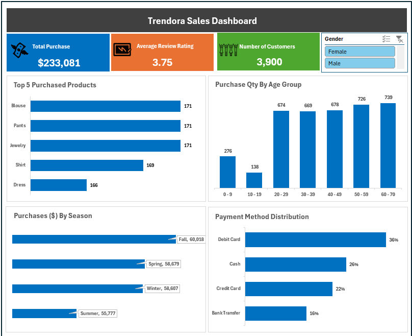
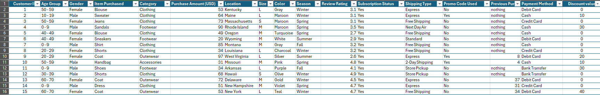

# Trendora Sales Report 
Analysis of the customer purchases dataset to give management an overview of business performance

## Dashboard

## Executive Summary
-	Trendora Management needs a simple dashboard that shows customer purchase trends and how they impact business performance.
-	Developed an interactive Excel dashboard consolidating their over 3000 transactions to track their KPIs accurately, understand their customer purchase behavior, sales trends, and impact on business. 
-	The analysis highlighted that most (89%) of the purchases were made by adults aged 20+ years 

## Business Problem
Trendora Management requires a straightforward dashboard that displays customer purchase trends and their impact on business performance

## Process and Methodology
## Tools Used: 
Microsoft Excel

## Data Sourcing & Overview
The dataset consists of 3,900 rows and 17 columns. This dataset contains transactional data across 4 different product categories in the regions where the store operates.

## Data Cleaning & Transformation
- Removed duplicate rows.
- Converted the date column to a date datatype and converted the time columns to the appropriate time datatype

## Data Preview

